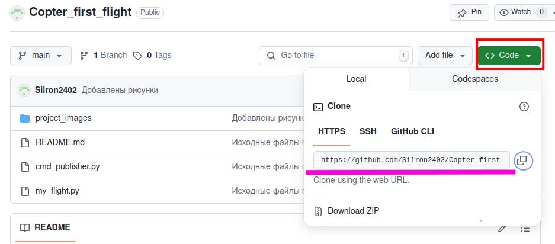

# Copter_first_flight
#### Введение
Данный репозиторий представляет собой учебный репозиторий, содержащий код с программой полета дрона по кругу. Код написан на языке python и включает в себя программу-паблишер cmd_publisher.py, отправляющую сообщения в топик /vehicle/desPose и программу my_flight.py, предназначенную для управления квадрокоптером типа iris в симуляторе gazebo. Дрон снабжен лазерным дальномером для поддержания высоты полета. Управление осуществляется путем чтения задания из топика /vehicle/desPose, получения данных о текущем положении дрона, расчете ошибки и формирования управляющего воздействия в виде задания целевых скоростей по всем трем координатным осям, а также скорости изменения угла рыскания. 

#### Этап 1. Создание пустого репозитория на платформе Github.com
Работа с репозиторием осуществляется на платформе Ubuntu v.20.04. Для создания пустого репозитория необходимо последовательно выполнить следующие действия:
Создание пустого репозитория на платформе Github выполняется  с главной страницы с помощью нажатия кнопки New как показано на рисунке 1. Перед выполнением действия необходимо зарегистрироваться или войти в существующий аккаунт.

Рисунок 1. Создание пустого репозитория с помощью нажатия кнопки New 
(обведено красным)

Открывается диалоговое окно нового репозитория. В окне Repository name необходимо задать имя репозитория. В поле Description (описание) при необходимости можно дать описание репозитория, указать его тип (публичный (Public) или приватный (Private)а также добавить файл Readme.md и тип лицензии.  После окончания всех действия нужно нажать зеленую кнопку Create Repository (Создать репозиторий). 

Рисунок 2. Диалоговое окно при создании нового репозитория. Кнопка create Repository обведена красным.

Созданный репозиторий будет иметь вид как показано на рисунке 3.

Рисунок 3. Пустой репозиторий, созданный на платформе Github.com

#### Этап 2. Клонирование пустого репозитория на компьютер

Выполним операцию клонирования репозитория на компьютер. Для этого необходимо получить ссылку на репозиторий. Для этого необходимо нажать кнопку <>Code (обведено красной рамкой на рисунке 4) и скопировать адрес репозитория во вкладке Local. Для этого удобно использовать кнопку Copy (обведено синим на рисунке 4).

Рисунок 4. Получение ссылки на репозиторий для клонирования

Далее в терминале следует ввести команду git clone и с помощью сочетания клавиш Ctrl+Shift+V добавить скопированный адрес и нажать Enter.

Рисунок 5. Вызов команды git clone для клонирования репозитория на компьютер пользователя

После окончания клонирования репозитория в терминале будет выведено сообщение аналогичное показанному на рисунке 6. 

Рисунок 6. Результат работы команды git clone

Репозиторий будет скопирован в данном случае в домашнюю директорию, где будет создана папка Copter_first_flight как показано на рисунке 7.

Рисунок 7. Содержимое домашней директории. Созданная папка выделена оранжевым.

#### Этап 3. Добавление файлов и внесение изменений в репозиторий

Добавим в папку Copter_first_flight файл myflight.py и вызовем команду git status для отображения состояния репозитория. Результат представлен на рисунке 8. Добавленный файл выделен красным цветом.

Рисунок 8. Результат вызова команды git status.

Добавим файл в репозиторий в область staged. Для этого вызовем команду git add myflight.py. После выполнения операции снова введем команду git status. В терминале будет выведено сообщение как показано на рисунке 9. Новый файл будет выделен зеленым цветом.

Рисунок 9. Результат выполнения команды git add и проверки состояния репозитория с помощью команды git status.

Аналогичным образом выполним добавление файла cmd_publisher.py и отредактируем файл Readme.md в среде Visual Code. 

Рисунок 10. Результат редактирования файла README.md в программе VisualStudio

После выполнения этих операций снова вызовем команду git status, а затем  вызовем команду git add * Для добавления всех файлов в репозиторий в пространство staged. В результате окно примет вид, показанный на рисунке 11.

Рисунок 11. Изменения, внесенные в пространство staged.

Выполним коммит с помощью команды git commit -m “Исходные файлы проекта”, позволяющей добавить файлы в репозиторий и ввести комментарий для коммита  после выполнения команды. Проверим состояние пространства staged помощью команды git status. 

Рисунок 12. Выполнение коммита с помощью команды git commit -m и проверка статуса репозитория с помощью команды git status.

Добавим папку с файлами в репозиторий. В корневой папке проекта создана папка product_images, содержащая рисунки, которые впоследствии будут использованы при создании html версии файла readme.
 

Рисунок 13. Файлы и папка, добавленные в файл проекта

После этого вызовем команду git add project_images/ для добавления всех файлов папки в пространство staged. Для отображения изменений воспользуемся командой git status.  Результат выполнения команд показан на рисунке 14.

Рисунок 14. Добавление папки и ее содержимого в репозиторий.

 Выполним коммит с помощью команды git commit. Результат работы команды представлен  на рисунке 15.

Рисунок 15. Выполнение коммита при добавлении папки и ее содержимого.

Выведем список изменений в репозитории с помощью команды git log. Результат выполнения команды представлен на рисунке 16.

Рисунок 16. Список изменений, полученный с помощью команды git log

Для получения подробного списка изменений используем команду  git log -p. На рисунке 17 приведен фрагмент выводимого сообщения.

Рисунок 17. Результат работы команды git log -p

#### Этап 4. Внесение изменений в удаленный репозиторий
Внесем изменения в удаленный репозиторий на платформе Github. Для этого применим команду git push. В терминале программа требует ввести логин и пароль как показано на рисунке 18.  

Рисунок 18. Запрос логина и пароля для доступа к удаленному репозиторию.

Пароль для доступа получим следующим образом:
На платформе github нажмем на иконку профиля и щелкнем левой кнопкой мыши на строке Settings
 

Рисунок 19. Выбор строки Settings в ниспадающем меню профиля

На вкладке профиля необходимо выбрать <Developer settings> как показано на рисунке 20.

Рисунок 20. Выбор настроек Developer settings>

В открывшемся окне необходимо нажать на кнопку Token (classic) (обведено красным на рисунке 21), затем щелкнуть на ниспадающем списке  generate new token (обведено синей рамкой) и выбрать Generate new token (обведено зеленой рамкой)

Рисунок 21. Диалоговое окно для генерации нового токена.

В открывшемся окне необходимо заполнить описание нового токена. Ограничим его применение только репозиторием Copter_first_flight. Для этого в области Repository access поставим флаг Only selected repositories и в ниспадающем списке репозиториев выберем Silron2402/Copter_first/flight как показано на рисунке 22

Рисунок 22. Установка ограничения доступа токена к репозиториям

После этого в области Permissions (разрешения) следует выбрать область Contents (содержание)  в ниспадающем списке задать Read and write (чтение и запись).

Рисунок 23. Настройка разрешений для публикации коммитов

После окончания настройки следует нажать кнопку Generate token (Генерировать токен) как показано на рисунке 24.

Рисунок 24. Кнопка Generate token 

Появится сообщение со сроком действия токена и его разрешениями. Для подтверждения создания необходимо нажать кнопку Generate token

Рисунок 25. Диалоговое окно подтверждения генерации токена 

Сгенерированный токен будет показан в открывшемся окне. Его необходимо скопировать и вставить в терминале (см. рис. 18) с помощью сочетания клавиш Ctrl+Shift+V.

Рисунок 26. Вкладка, содержащая сгенерированные токены. 
Кнопка копирования обведена красным

После ввода команды в терминал будет выведены сообщения аналогичные показанным на рисунке 27.

Рисунок 27 Окно терминала после выполнения команды git push

Вид репозитория на платформе github представлен на рисунке 28.
а)                                                                
  
б)   
  
Рисунок 28. Первая страница репозитория (а) и содержимое папки project_images (б)

#### Этап 5. Ветвление и слияние
Создадим новую ветку проекта с названием flight_task_mod, в которой будем выполнять изменения файла cmd_publisher.py.  Для этого вызовем команду git checkout -b flight_task_mod. В результате выполнения команды checkout создана новая ветвь и выполнен переход в нее.

  
Рисунок 29. Создание ветки и переход в нее с помощью команды git checkout -b 

 С помощью редактора nano внесем изменения в файл cmd_publisher.py. Изменим параметр circle_radius и скорость отправки сообщений self.rate = rospy.Rate(10) как показано на рисунке 30.

  
Рисунок 30. Создание ветки и переход в нее с помощью команды git checkout -b 

Также в процессе работы были внесены изменения в файл рисунок1.png в папке project_images. В результате вызов команды git status показывает два изменения, не внесенных в пространство staged:

  
Рисунок 31. Изменения, внесенные в  проект. 

С помощью команды git add* добавим изменения в пространство staged, а замет вызовем команду git status. В терминале появятся сообщения о том, что для ветки flight_task_mod изменения подготовлены для коммита:

  
Рисунок 32. Изменения подготовленные для коммита

Вызовем команду git commit -m, а затем добавим ветку с удаленный репозиторий на платформе Github. Для этого введем команду git push --set-upstream origin flight_task_mod. Далее следует ввести имя пользователя и токен для доступа к репозиторию как это было описано выше. В результате выполнения описанных действий в терминал будет выведена следующая информация:

  
Рисунок 33. Результат создания ветки в репозитории

В репозитории появится ветка, как показано на рисунке 34.

  
Рисунок 34. Отображение ветки в репозитории на платформе github

Содержимое ветки flight_task_mod показано на рисунке 35. Красным обведена кнопка, приглашающая выполнить сравнение и слияние веток в удаленном репозитории (pull request).
	

  
Рисунок 35. Содержимое ветки flight_task_mod

Выполним слияние  веток в терминале. Ввиду того, что команда merge присоединяет ветку к текущей, необходимо проверить, какая ветка является  текущей с помощью команды git branch, а затем, при необходимости, сменить ветку с помощью команды git checkout. В качестве примера выполним слияние ветки flight_task_mod с веткой main. Для этого вызовем команду git branch, а затем команду git checkout main, чтобы перейти на ветку main как показано на рисунке 36.

Рисунок 36. Переход на ветку main

Для слияния веток воспользуемся командой git merge и укажем имя ветки, которую сливаем с веткой main, т. е. flight_task_mod.

 
Рисунок 37. Результат слияния веток с помощью команды git merge

#### Этап 6. Операция Pull-request

Создадим новую ветку проекта с названием flight_contr_mod, в которой будем выполнять изменения файла my_flight.py.  Для этого вызовем команду git checkout -b flight_contr_mod, а дальнейшие действия по созданию ветки выполним по аналогии с п. 4. Во вновь созданной ветке будем изменять с помощью редактора nano файл my_flight.py.
Внесем изменения в код: уберем организацию потока сообщений при управлении дроном. Удалим методы start_setpoint_thread, stop_setpoint_thread, stop_setpoint_thread (выделено цветом на рисунке 38), переменные setpoint_thread и stop_thread в тексте программы и отредактируем метод, предназначенный для  обработки данных топика /vehicle/desPose  recieved_task. 

Рисунок 38. Удаляемый фрагмент текста программы в файле my_flight.py.

Вызов команды git status указывает на изменение файла my_flight.py, не внесенные в пространство staged.

Рисунок 39. Изменения, не внесенные в пространство staged

Выполним по аналогии с п.4 добавление в пространство staged, коммит и операцию добавления изменений в удаленный репозиторий с помощью команды git push. Результаты показаны на рисунке 40. Область с кнопкой для выполнения операции pull request выделена желтым.

Рисунок 40. Создана новая ветка и выполнена подготовка к операции pull request.

После нажатия кнопки pull request открывается новая вкладка, позволяющая выполнить настройки перед выполнением операции. 

Рисунок 41. Вкладка, позволяющая настроить операцию pull request.

В ниспадающем списке, показанном на рисунке 42 имеется возможность выбора ветки, с которой происходит слияние

Рисунок 42. Выпадающий список для выбора веток, с которой происходит слияние.

Также возможно выбрать ветку, которая будет слита с выбранной ранее (см. рисунок 43)

Рисунок 43. Выпадающий список для выбора ветки для слияния.

Перед операцией pull request можно указать название операции в окне add a title и добавить описание в окне add a description как показано на рисунке 44. 

Рисунок 44. Выпадающий список для выбора ветки для слияния.

Ниже приводится список внесенных изменений. Часть изменений показана на рисунке 45. Красным выделены удаляемые объекты, а зеленым- добавленные.

Рисунок 45. Коммиты и изменения, записанные в ветке flight_contr_mod

После того, как внесены изменения, выполним операцию pull request нажатием  кнопки create pull request как показано на рисунке 46.

Рисунок 46. Выполнение операции pull request. Кнопка обведена красным.

Результат выполнения операции представлен на рисунке 47.

Рисунок 47. Результат выполнения операции pull request

Далее выполним операцию слияния с помощью нажатия кнопки merge pull request. Результат показан на рисунке 48.

Рисунок 48. Результат выполнения команды merge pull request

Для завершения операции необходимо нажать кнопку confirm merge для подтверждения слияния. При успешном окончании операции будет выведено сообщение и будет предложено удалить ветку flight_contr_mod.

Рисунок 49. Результат выполнения операции pull request

После удаления ветки flight_contr_mod с помощью кнопки delete branch будет выведено сообщение об успешном выполнении операции pull request как показано на рисунке 50.

Рисунок 50. Результат окончания операции pull request после удаления ветки flight_contr_mod

#### Заключение
1. Изучены операции по организации репозитория на компьютере и удаленном сервере
2. Создан репозиторий на платформе github и выполнены операции по добавлению, клонированию, ветвлению, слиянию, а также операция pull request
3. Внесены изменения в файл README.md, файл cmd_publisher.py и my-flight.py
4. Применение репозитория с историей изменений позволяет сократить время разработки, а также отслеживать изменения с целью повышения устойчивости кода и возможности оперативного  его восстановления

